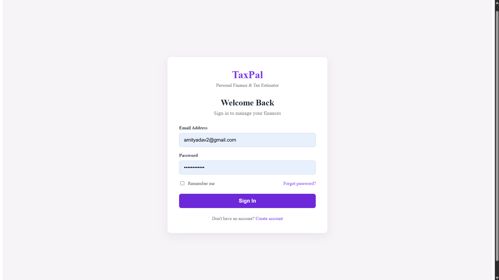
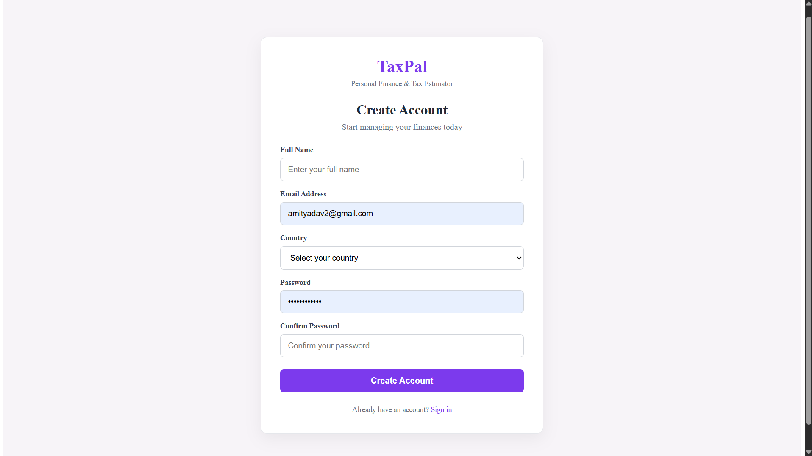
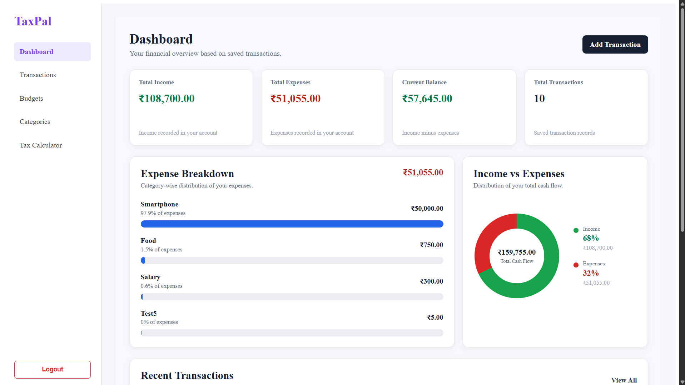
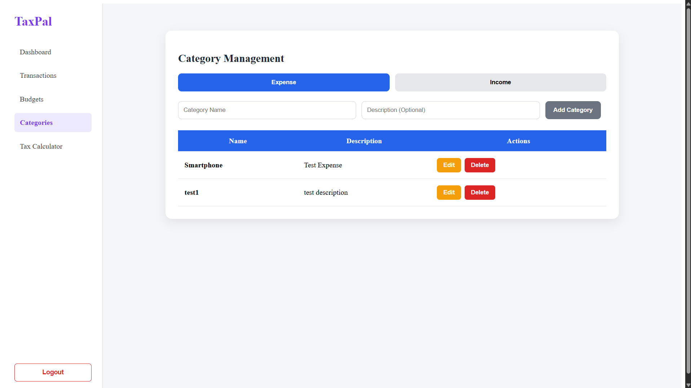
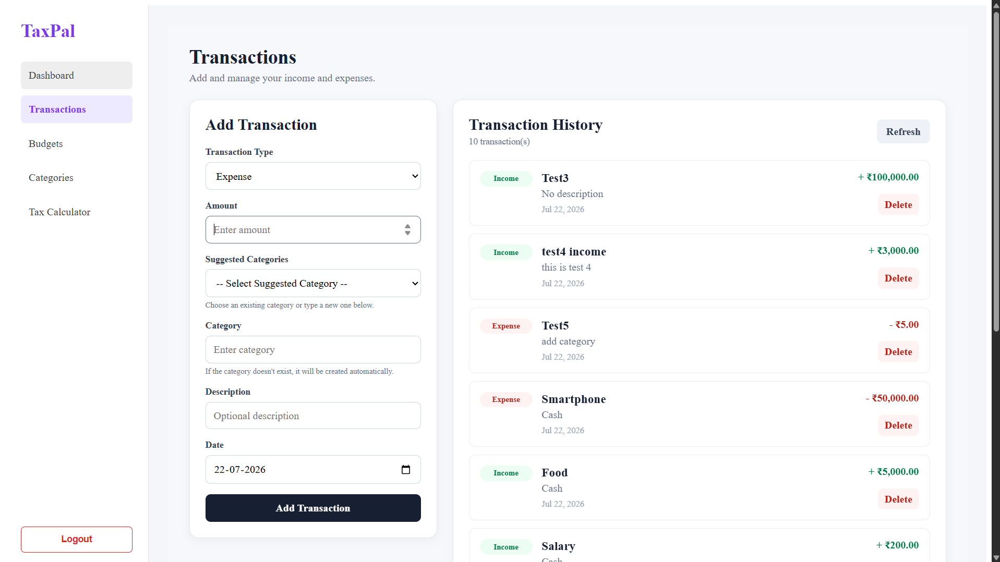
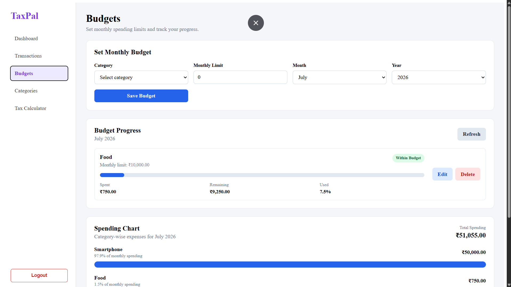
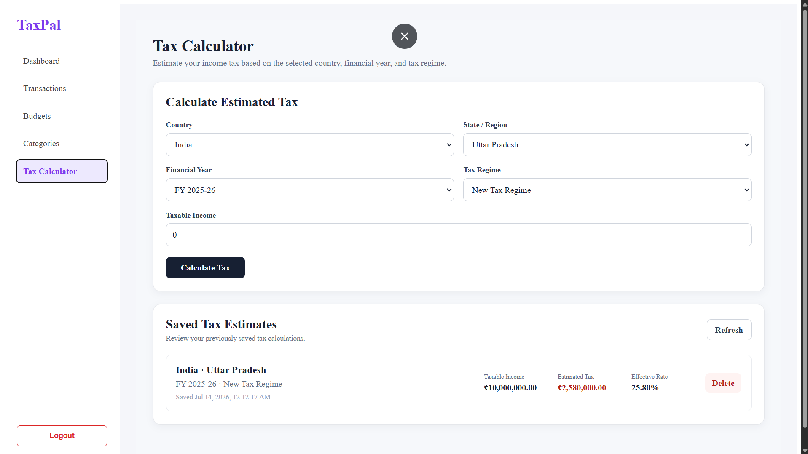

# 💰 TaxPal

TaxPal is a full-stack personal finance and tax management application built with **Angular**, **Node.js**, **Express.js**, and **MongoDB**. It enables users to securely manage income, expenses, categories, budgets, and estimate taxes through an intuitive and user-friendly interface.

---

# 🚀 Features

## 🔐 Authentication
- User Registration
- User Login
- JWT-based Authentication
- Protected Routes

## 📊 Dashboard
- Financial Overview
- Quick Navigation to Application Modules

## 📂 Category Management
- Create Categories
- Edit Categories
- Delete Categories
- Income & Expense Categories
- Duplicate Category Prevention
- Automatic Category Creation from Transactions

## 💳 Transaction Management
- Add Transactions
- Edit Transactions
- Delete Transactions
- Category Selection
- Automatic Category Creation
- Transaction History

## 🧮 Tax Calculator
- Tax Estimation
- Backend Tax Calculation APIs

---

# 🛠 Tech Stack

### Frontend
- Angular
- TypeScript
- HTML5
- CSS3

### Backend
- Node.js
- Express.js
- REST APIs

### Database
- MongoDB

### Authentication
- JSON Web Token (JWT)

### Tools
- Git
- GitHub
- VS Code
- Postman

---

# 📁 Project Structure

```text
TaxPal-Batch-3
│
├── backend
│   ├── src
│   │   ├── controllers
│   │   ├── middleware
│   │   ├── models
│   │   ├── routes
│   │   ├── utils
│   │   └── server.js
│   └── package.json
│
├── frontend
│   ├── src
│   └── package.json
│
├── screenshots
│   ├── login.png
│   ├── signup.png
│   ├── dashboard.png
│   ├── categories.png
│   ├── transactions.png
│   ├── budget.png
│   └── tax-calculator.png
│
└── README.md
```

---

# 📋 Prerequisites

Before running the project, ensure you have the following installed:

- Node.js (v18 or later)
- npm
- MongoDB (Local or MongoDB Atlas)
- Git

---

# ⚙️ Installation

## 1. Clone the Repository

```bash
git clone https://github.com/springboardmentor09881n-rgb/TaxPal-Batch-3.git
```

## 2. Navigate to the Project Directory

```bash
cd TaxPal-Batch-3
```

## 3. Backend Setup

```bash
cd backend
npm install
npm start
```

Backend runs at:

```
http://localhost:5000
```

## 4. Frontend Setup

Open another terminal and run:

```bash
cd frontend
npm install
npm start
```

Frontend runs at:

```
http://localhost:4200
```

---

# 🔑 Environment Variables

Create a `.env` file inside the **backend** directory and add the following variables:

```env
PORT=5000
MONGO_URI=your_mongodb_connection_string
JWT_SECRET=your_secret_key
```

---

# 📷 Screenshots

### Login


### Sign Up


### Dashboard


### Categories


### Transactions


### Budget


### Tax Calculator


---

# 🎯 Future Enhancements

- Budget Analytics
- Interactive Charts & Graphs
- Monthly Financial Reports
- Search & Filter Transactions
- Export Reports (PDF/Excel)
- Responsive Dashboard
- Dark Mode
- Multi-Currency Support

---

# 👨‍💻 Team

Developed as part of the **Infosys Springboard Internship Project**.


### 👥 Team Members

- **Amit Yadav** — GitHub: [@amityadav](https://github.com/amityadav)
- **MAYA SHATHI S** — GitHub: [@Mayashathi04](https://github.com/Mayashathi04)
- **Piyush Munde** — GitHub: [@codingwithpiyush](https://github.com/codingwithpiyush)
- **Member 4** — GitHub: [@username4](https://github.com/username4)
- **Member 5** — GitHub: [@username5](https://github.com/username5)
---

# 📄 License

This project was developed for educational purposes as part of the **Infosys Springboard Internship Program**.
>>>>>>> amityadav
