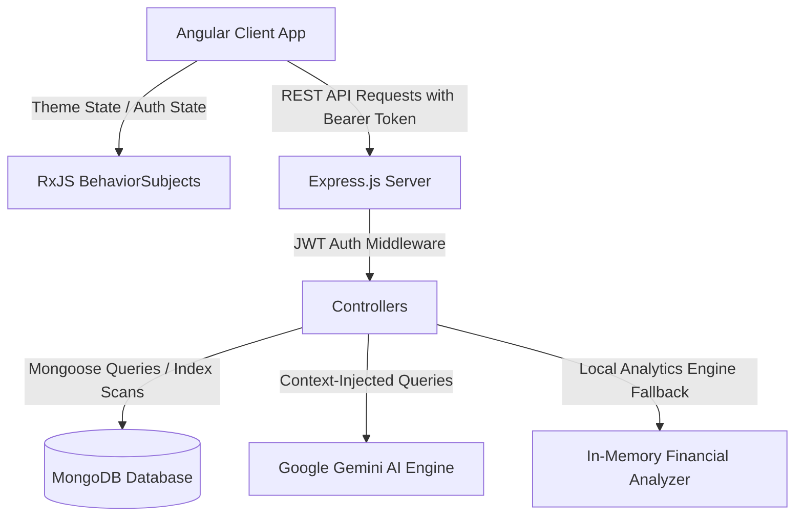

# 💰 TaxPal — Smart Personal Finance & Tax Management Platform

**TaxPal** is a full-stack, enterprise-grade personal finance, budget tracking, and tax estimation platform built with **Angular (v18 Standalone)**, **Node.js**, **Express.js**, and **MongoDB**. It empowers individuals and professionals to securely track income and expenses, monitor category budgets in real time, generate formatted financial statements, estimate income tax liability under the latest tax regimes, and interact with an **AI Financial Assistant**.

---

## 🌟 Key Highlights & Newly Added Modules

- 🌓 **Full-App Persistent Dark & Light Mode**: Seamless theme switching with high-contrast color palettes, glassmorphic accents, and instant `localStorage` persistence.
- 🖼️ **Interactive Profile Picture & Sync**: Direct device photo selection with client-side HTML5 Canvas compression (~30KB), instant reactive navbar synchronization via RxJS `currentUser$`, and persistent avatar storage.
- 👁️ **Password Visibility Controls**: Intuitive show/hide eye toggles across Login, Registration, and Password Change security modules.
- 📊 **Multi-Format Financial Reports**: Generate, preview, and download financial statements in **PDF**, **CSV**, and formatted **Excel (.xls)** workbooks with styled KPI summaries.
- 🎯 **Smart Budget Tracking**: Category-based budget ceilings with real-time visual progress tracks and high-contrast status pills (*Within Budget* & *Over Budget*).
- 🤖 **Hybrid AI Financial Assistant**: Floating chat widget powered by Google Gemini and a live database analytics engine answering spending, balance, budget, and tax questions in real-time.
- ⚡ **High-Performance Architecture**: MongoDB compound indexing and Mongoose `.lean()` execution for sub-50ms query speeds.

---

## 📑 Table of Contents

1. [Module Overview](#-module-overview)
2. [Tech Stack](#-tech-stack)
3. [System Architecture](#-system-architecture)
4. [API Reference](#-api-reference)
5. [Project Structure](#-project-structure)
6. [Prerequisites & Setup](#-prerequisites--setup)
7. [Environment Configuration](#-environment-configuration)
8. [UI & Screenshots](#-ui--screenshots)
9. [Team & Contributors](#-team--contributors)
10. [License](#-license)

---

## 🚀 Module Overview

### 1. 🔐 Authentication & Security
- Secure registration and login with bcrypt password hashing and JSON Web Tokens (JWT).
- Protected API routes and client-side route guards.
- **Show / Hide Password**: Embedded eye icon toggles for all password inputs.
- Active session management with reactive auth state across components.

### 2. 📊 Interactive Dashboard
- Real-time financial KPI cards: **Total Income**, **Total Expenses**, **Net Savings / Balance**, and **Tax Liability**.
- Dynamic Expense Distribution chart with interactive category legends.
- Recent transactions list with date formatting and category tags.

### 3. 💳 Transaction Management
- Comprehensive income and expense tracking with custom dates, categories, and descriptions.
- Search and suggested category auto-complete.
- Compound indexed queries ensuring immediate rendering of transaction history.
- Safe deletion with instant reactive UI updates.

### 4. 📂 Category Management
- Pre-loaded default categories (Salary, Freelance, Investments, Rent, Food & Dining, Utilities, Travel, Shopping, etc.).
- Custom user category creation with unique duplicate prevention.
- Seamless category-to-transaction assignment.

### 5. 🎯 Budgets & Spending Limits
- Monthly budget allocation by category.
- Real-time spending progress bars with percentage indicators.
- **High-contrast status badges**: Bold emerald *Within Budget* and crimson *Over Budget* badges.
- Instant calculation of remaining allowances vs. spending overruns.

### 6. 🧮 Global Multi-Country Tax Calculator
- **10 Country Tax Engines Supported**:
  - 🇮🇳 **India** (New Tax Regime FY 2025-26):
    - Up to ₹4,00,000: **0% (Nil)**
    - ₹4,00,001 – ₹8,00,000: **5%**
    - ₹8,00,001 – ₹12,00,000: **10%**
    - ₹12,00,001 – ₹16,00,000: **15%**
    - ₹16,00,001 – ₹20,00,000: **20%**
    - ₹20,00,001 – ₹24,00,000: **25%**
    - Above ₹24,00,000: **30%**
    - *Advance Tax Schedule*: 15% (June 15), 30% (Sept 15), 30% (Dec 15), 25% (March 15).
  - 🇺🇸 **United States** (Federal Single Filer Slabs):
    - $0 – $11,000: **10%** | $11,001 – $44,725: **12%** | $44,726 – $95,375: **22%** | $95,376 – $182,100: **24%** | $182,101 – $231,250: **32%** | $231,251 – $578,125: **35%** | Above $578,125: **37%**
    - *IRS Quarterly Estimated Due Dates*: Q1 (Apr 15), Q2 (Jun 15), Q3 (Sep 15), Q4 (Jan 15).
  - 🇨🇦 **Canada** (Federal Tax Brackets):
    - $0 – $53,359: **15%** | $53,360 – $106,717: **20.5%** | $106,718 – $165,430: **26%** | $165,431 – $235,675: **29%** | Above $235,675: **33%**
    - *CRA Instalments*: Q1 (Mar 15), Q2 (Jun 15), Q3 (Sep 15), Q4 (Dec 15).
  - 🇬🇧 **United Kingdom** (HMRC Tax Slabs):
    - £0 – £12,570: **0% (Personal Allowance)** | £12,571 – £50,270: **20% (Basic)** | £50,271 – £125,140: **40% (Higher)** | Above £125,140: **45% (Additional)**
    - *Payment on Account*: First (Jan 31), Second (July 31).
  - 🇦🇺 **Australia** (ATO Resident Slabs):
    - $0 – $18,200: **0% (Tax-Free Threshold)** | $18,201 – $45,000: **19%** | $45,001 – $120,000: **32.5%** | $120,001 – $180,000: **37%** | Above $180,000: **45%**
    - *Quarterly BAS Schedule*: Q1 (Oct 28), Q2 (Feb 28), Q3 (Apr 28), Q4 (Jul 28).
  - 🇩🇪 **Germany** (Einkommensteuer Brackets):
    - €0 – €10,908: **0% (Grundfreibetrag)** | €10,909 – €62,810: **14%** | €62,811 – €277,826: **42%** | Above €277,826: **45%**
    - *Finanzamt Prepayments*: Q1 (Mar 10), Q2 (Jun 10), Q3 (Sep 10), Q4 (Dec 10).
  - 🇸🇬 **Singapore** (IRAS Resident Slabs):
    - Progressive brackets from **0%** up to **22%** across 11 tiers (S$20k tax-free threshold).
  - 🇦🇪 **United Arab Emirates (UAE)** (Corporate / Commercial Tax):
    - 0% up to AED 375,000, 9% on taxable profit above AED 375,000.
  - 🇫🇷 **France** (Impôt sur le revenu):
    - €0 – €10,777: **0%** | €10,778 – €27,478: **11%** | €27,479 – €78,570: **30%** | €78,571 – €168,994: **41%** | Above €168,994: **45%**
  - 🇯🇵 **Japan** (NTA Income Tax):
    - ¥0 – ¥1.95M: **5%** | ¥1.95M – ¥3.3M: **10%** | ¥3.3M – ¥6.95M: **20%** | ¥6.95M – ¥9M: **23%** | ¥9M – ¥18M: **33%** | ¥18M – ¥40M: **40%** | Above ¥40M: **45%**
- **Dynamic Regional State / Province Dropdowns**: Automatically loads states/regions based on selected country (e.g. 28 Indian States & 8 UTs, 10 US States, 7 Canadian Provinces, 8 Australian States, German States, UK Regions, etc.).
- **Deductions Support**: Business Expenses, Retirement Contributions (401k/Super/NPS/RRSP), Health Insurance, Home Office deductions.
- **Visual Progressive Breakdown**: Interactive bracket table displaying exact taxable slice, rate %, and tax per bracket.
- **Advance Tax Due Dates**: Automated quarterly payment calendar with payment percentages.
- **Estimate History**: Save estimates to database, view historical cards, and delete previous estimates.

### 7. 📈 Financial Reports & Multi-Format Exports
- Custom statement generation: **Income vs. Expense**, **Category Breakdown**, and **Annual Summary**.
- Filter by predefined periods (Current Month, Last Month, YTD) or custom date ranges.
- **Multi-Format Export**:
  - 📄 **PDF**: Print-optimized statement layout with branded header.
  - 📊 **CSV**: Raw tabular data export for spreadsheet analysis.
  - 📑 **Excel (.xls)**: Formatted SpreadsheetML workbook with styled headers, metric summaries, and currency formatting.
- Icon-only table row actions (👁️ View Preview, 📥 Download, 🗑️ Delete).

### 8. 👤 Profile Settings & Avatar Management
- Update full name, phone number, address, and password.
- **Interactive Avatar Picker**: Click the profile badge to pick images directly from local storage.
- Client-side Canvas scaling down to max 300px JPEG to prevent `localStorage` overflow and payload errors.
- Reactive `currentUser$` stream updates top navbar avatar and name without page refresh.

### 9. 🤖 AI Financial Assistant Widget
- Floating chat bubble with rich dark and light mode themes.
- Powered by a hybrid engine: **Google Gemini 1.5 Flash** with an automatic **Local Financial Analytics Fallback**.
- Answers queries regarding:
  - *"Am I over budget on travel?"*
  - *"How much did I spend on food this month?"*
  - *"What was my total income last month?"*
  - Step-by-step guidance on adding transactions, budgets, reports, and calculating taxes.

---

## 🛠 Tech Stack

| Layer | Technologies |
| :--- | :--- |
| **Frontend** | Angular 18 (Standalone Components), TypeScript, RxJS, HTML5 Canvas, Vanilla CSS3 |
| **Backend** | Node.js, Express.js, RESTful API architecture |
| **Database** | MongoDB, Mongoose ODM (with compound indexing & `.lean()` queries) |
| **AI / LLM** | Google Generative AI (`@google/generative-ai` Gemini 1.5 Flash) |
| **Authentication** | JSON Web Tokens (JWT), bcrypt.js |
| **Tools & Testing** | VS Code, Postman, Angular CLI, Git, GitHub |

---

## 🏗 System Architecture



---

## 📡 API Reference

### 🔐 Authentication (`/api/auth`)
| Method | Endpoint | Description | Auth Required |
| :--- | :--- | :--- | :--- |
| `POST` | `/api/auth/register` | Register new user | No |
| `POST` | `/api/auth/login` | Login user & receive JWT | No |
| `GET` | `/api/auth/profile` | Get current user profile & avatar | Yes |
| `PUT` | `/api/auth/profile` | Update profile info & avatar | Yes |
| `PUT` | `/api/auth/password` | Change user password | Yes |

### 💳 Transactions (`/api/transactions`)
| Method | Endpoint | Description | Auth Required |
| :--- | :--- | :--- | :--- |
| `GET` | `/api/transactions` | Fetch all user transactions | Yes |
| `POST` | `/api/transactions` | Create income or expense record | Yes |
| `DELETE` | `/api/transactions/:id` | Delete transaction | Yes |

### 🎯 Budgets (`/api/budgets`)
| Method | Endpoint | Description | Auth Required |
| :--- | :--- | :--- | :--- |
| `GET` | `/api/budgets` | Get all configured category budgets | Yes |
| `POST` | `/api/budgets` | Create / update budget limit | Yes |
| `DELETE` | `/api/budgets/:id` | Delete budget limit | Yes |

### 📂 Categories (`/api/categories`)
| Method | Endpoint | Description | Auth Required |
| :--- | :--- | :--- | :--- |
| `GET` | `/api/categories` | Get default and user custom categories | Yes |
| `POST` | `/api/categories` | Add custom category | Yes |
| `PUT` | `/api/categories/:id` | Update category details | Yes |
| `DELETE` | `/api/categories/:id` | Delete custom category | Yes |

### 🧮 Tax Calculator (`/api/tax`)
| Method | Endpoint | Description | Auth Required |
| :--- | :--- | :--- | :--- |
| `POST` | `/api/tax/calculate` | Calculate income tax breakdown | Yes |
| `GET` | `/api/tax/history` | Get saved tax calculations | Yes |
| `DELETE` | `/api/tax/history/:id` | Delete saved tax record | Yes |

### 📈 Reports (`/api/reports`)
| Method | Endpoint | Description | Auth Required |
| :--- | :--- | :--- | :--- |
| `GET` | `/api/reports` | Get user generated reports | Yes |
| `POST` | `/api/reports/generate` | Generate and save financial report | Yes |
| `DELETE` | `/api/reports/:id` | Delete report record | Yes |

### 🤖 AI Chat Assistant (`/api/chat`)
| Method | Endpoint | Description | Auth Required |
| :--- | :--- | :--- | :--- |
| `POST` | `/api/chat` | Submit financial / app query to assistant | Optional |

---

## 📁 Project Structure

```text
TaxPal-Batch-3
│
├── backend
│   ├── src
│   │   ├── config
│   │   │   └── db.js                  # MongoDB Mongoose connection
│   │   ├── controllers
│   │   │   ├── authController.js       # Auth, Profile, & Avatar controller
│   │   │   ├── budgetController.js     # Budget management logic
│   │   │   ├── categoryController.js   # Category management logic
│   │   │   ├── chatController.js       # AI Chat Assistant & Analytics Engine
│   │   │   ├── reportController.js     # Financial report generator
│   │   │   ├── taxController.js        # Income tax calculation logic
│   │   │   └── transactionController.js# Transaction CRUD logic
│   │   ├── middleware
│   │   │   └── authMiddleware.js       # JWT protect & optionalAuth
│   │   ├── models
│   │   │   ├── Budget.js               # Budget schema
│   │   │   ├── Category.js             # Category schema
│   │   │   ├── Report.js               # Report metadata schema
│   │   │   ├── TaxCalculation.js       # Tax calculation schema
│   │   │   ├── Transaction.js          # Transaction schema (Indexed)
│   │   │   └── User.js                 # User schema with avatar field
│   │   ├── routes
│   │   │   ├── authRoutes.js
│   │   │   ├── budgetRoutes.js
│   │   │   ├── categoryRoutes.js
│   │   │   ├── chatRoutes.js
│   │   │   ├── reportRoutes.js
│   │   │   ├── taxRoutes.js
│   │   │   └── transactionRoutes.js
│   │   └── server.js                   # Express server entry point
│   └── package.json
│
├── frontend
│   ├── src
│   │   ├── app
│   │   │   ├── components
│   │   │   │   ├── app-layout          # Master layout with navbar & sidebar
│   │   │   │   ├── chat-support        # AI floating chat widget
│   │   │   │   ├── navbar              # Top navbar with profile & theme toggle
│   │   │   │   └── sidebar             # Left navigation menu
│   │   │   ├── pages
│   │   │   │   ├── budgets             # Budget progress tracking
│   │   │   │   ├── categories          # Category management
│   │   │   │   ├── dashboard           # Financial analytics overview
│   │   │   │   ├── login               # Login page with show/hide password
│   │   │   │   ├── register            # Registration with show/hide password
│   │   │   │   ├── reports             # Multi-format report generator
│   │   │   │   ├── settings            # Profile & photo update, security
│   │   │   │   └── tax-calculator      # Tax estimation tool
│   │   │   ├── services
│   │   │   │   ├── auth.ts             # Auth service with reactive currentUser$
│   │   │   │   ├── budget.ts           # Budget API service
│   │   │   │   ├── category.service.ts # Category API service
│   │   │   │   ├── chat.service.ts     # AI Chat API service
│   │   │   │   ├── report.service.ts   # Report API service
│   │   │   │   ├── tax.service.ts      # Tax API service
│   │   │   │   ├── theme.service.ts    # Persistent Dark/Light theme manager
│   │   │   │   └── transaction.ts      # Transaction API service
│   │   │   ├── app.config.ts
│   │   │   ├── app.routes.ts           # Client routing configuration
│   │   │   └── app.ts
│   │   ├── styles.css                  # Global design system & dark theme tokens
│   │   └── main.ts
│   ├── angular.json
│   ├── tsconfig.json
│   └── package.json
│
├── screenshots                         # Application screenshots
└── README.md                           # Documentation
```

---

## 📋 Prerequisites & Setup

Ensure you have the following installed on your machine:
- **Node.js**: `v18.x` or higher
- **npm**: `v9.x` or higher
- **MongoDB**: Local MongoDB instance (`mongodb://127.0.0.1:27017/taxpal`) or MongoDB Atlas URI

### 1. Clone the Repository
```bash
git clone https://github.com/springboardmentor09881n-rgb/TaxPal-Batch-3.git
cd TaxPal-Batch-3
```

### 2. Backend Installation & Run
```bash
cd backend
npm install
npm start
```
The backend server runs at: `http://localhost:5000`

### 3. Frontend Installation & Run
Open a new terminal window:
```bash
cd frontend
npm install
npm start
```
The Angular web application will launch at: `http://localhost:4200`

---

## 🔑 Environment Configuration

Create a `.env` file in the **backend** directory:

```env
PORT=5000
MONGODB_URI=mongodb://127.0.0.1:27017/taxpal
JWT_SECRET=taxpal_super_secure_jwt_secret_key_2026
GEMINI_API_KEY=your_google_gemini_api_key_here
```

---

## 📷 UI & Screenshots

| Module | Preview |
| :--- | :--- |
| **Dashboard** | Overview of savings, expenses, category distribution, and KPI cards |
| **Transactions** | Form for adding income/expenses with suggestion chips and history list |
| **Budgets** | Category spending ceilings with dynamic progress bars and status badges |
| **Tax Calculator** | Indian New Tax Regime tax breakdown with historical record storage |
| **Reports** | Multi-format statement generator with PDF, CSV, and Excel downloads |
| **Dark Theme** | Full-app dark palette with persistent Sun/Moon top navbar toggle |
| **AI Assistant** | Floating widget answering real-time financial and app usage queries |

---

## 👨‍💻 Team & Contributors

Developed as part of the **Infosys Springboard Internship Project (Batch 3)**.

### 👥 Team Members
- **Sreeja Reddy Chowdavaram** — GitHub: [@SreejaReddyChowdavaram](https://github.com/SreejaReddyChowdavaram)
- **Amit Yadav** — GitHub: [@theamityadavv](https://github.com/theamityadavv)
- **MAYA SHATHI S** — GitHub: [@Mayashathi04](https://github.com/Mayashathi04)
- **Piyush Munde** — GitHub: [@codingwithpiyush](https://github.com/codingwithpiyush)
- **Keerthi M R** — GitHub: [@keerthimr22](https://github.com/keerthimr22)

---

## 📄 License

This project is licensed for educational and internship evaluation purposes under the **Infosys Springboard Internship Program**.

